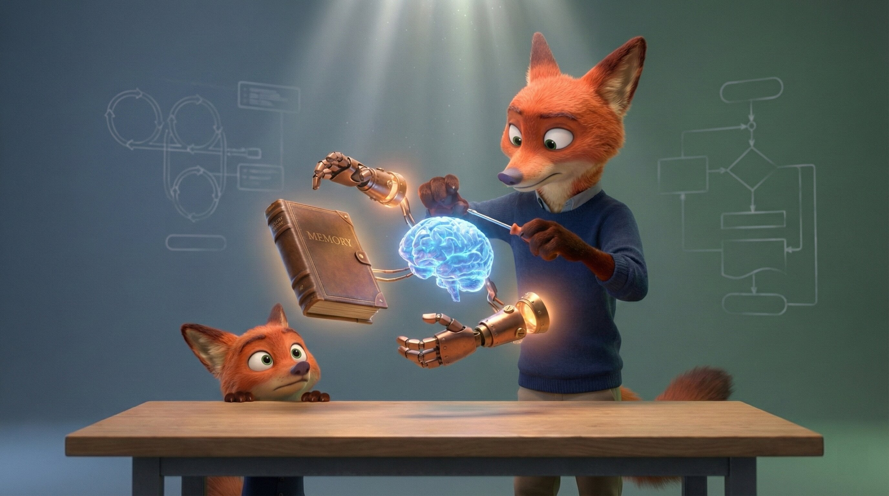
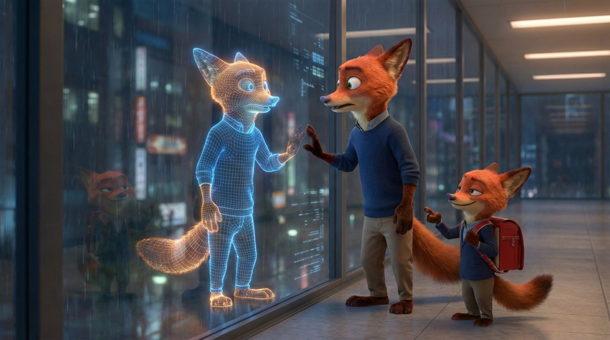

My kid cracked the code on AI agents yesterday. Accidentally, obviously.

I was practicing a presentation about agentic workflows, you know, pacing around the living room, narrating slides to nobody, and he was watching from the couch like I was performing a particularly confusing magic trick. The next morning, on the walk to school, he hit me with: "So what are those agent things, actually?"

I did what any self-respecting engineer would do. I gave him a five-minute answer to a ten-second question. Context windows. Tool calling. ReAct loops. The whole parade.

He thought about it for a moment, shrugged, and said: "Ok, so they're basically just people."

Lol. I've been thinking about that ever since.

## The Anatomy

If you strip away the hype and the venture capital fairy dust, an AI agent is really just three things stitched together:

**The Brain (the LLM).** This is the thinking part. Pattern recognition, reasoning, language. It's impressive on its own, but it's completely lobotomized without anything to act on. A ghost in the shell with no shell.

**The Hands (the Tools).** API calls, file systems, browsers, scripts. These are how the agent actually touches the world. Without them, the brain is just a very expensive parrot.

**The Memory (the Context).** Conversation history, stored facts, instructions. This is what gives the agent continuity. Without memory, every interaction starts from zero, like talking to someone with amnesia who also happens to be a genius.

Put them together and you get a loop: receive a question, think, act, observe, think again, act again, and eventually present an answer. That's it. That's the whole architecture. Seriously.

## The Mirror

Now here's the part that my kid figured out before many LinkedIn thought leaders.

Think about what happens when you ask a developer a question they don't know the answer to. They don't just hallucinate (well, some do, let's be real). But a good dev will realize they're stuck, open a browser (the tools), read three Stack Overflow tabs (the loop), synthesize the information (the brain), and then give you a coherent answer. If it's important, they'll write it down somewhere (the memory) so they don't have to do it again next week.

That's not a metaphor for how agents work. That *is* how agents work. It's an isomorphism, a structural mirror between biological cognition and digital architecture.

We didn't invent some alien form of intelligence. We just looked at how humans already solve problems — think, act, observe, repeat — and wrote it down in code. The agent loop is the human loop, externalized.

So maybe we're not building "smart software" at all. Maybe we're just building mirrors. And my eight-year-old saw his reflection before many of us did.

