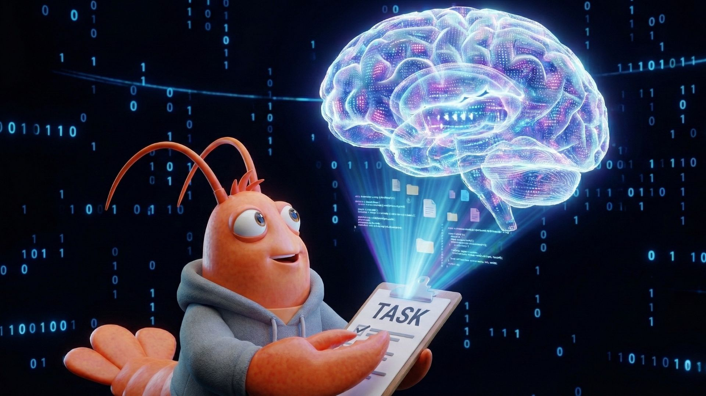

# Understanding OpenClaw’s Architecture (A High-Level Tour)

OpenClaw (formerly Clawdbot / Moltbot) has been getting a lot of attention recently. People describe it as an “AI agent”, a “local assistant”, or even “an AI that controls your computer”.

All of those are partially true — but they can also be confusing. (If you want to understand the basics of how AI agents work in general, [I wrote a primer on that](https://sergiocarrilho.medium.com/building-an-ai-coding-agent-in-100-lines-of-kotlin-f9af28e6aeb0).)

This article explains OpenClaw’s architecture at a high level, without diving into implementation details. The goal is to give you a clear mental model of what OpenClaw is made of and how the pieces fit together.

> **TL;DR:** Great execution, but it’s not magic. It’s a script that connects a chat app to an LLM and gives it permission to touch your files. Basically a glorified bridge.

## The Big Picture

At its core, OpenClaw connects three things:
1) You (via chat apps or a terminal)
2) An AI model (like ChatGPT or Claude)
3) Your computer (files, browser, scripts, tools)

You can think of it as a bridge between natural language and real actions on a machine.

To make this work reliably, OpenClaw is structured into a few main components: The gateway, the brain, the hands, the memory and the control loop.
Let's break these down.

## 1. The Gateway (How Messages Get In)

Most AI tools live inside a single app or website. OpenClaw doesn't. Instead, it runs a daemon (background service) on your actual machine and listens for messages from different places such as chat platforms (Telegram, Discord, WhatsApp, etc) and a local command-line interface. It means you can talk to your computer from your phone. Convenient.

The Gateway is the part responsible for this.

What it does:
1) Receives messages from different channels
2) Converts them into a standard internal format
3) Sends them to the rest of the system for processing

Why this matters:
OpenClaw doesn’t care where you talk to it from. A message sent from Telegram and one typed locally are treated the same way.

## 2. The Brain (The AI Model)

OpenClaw itself is not an AI model. Instead, it outsources cognition to OpenAI (ChatGPT), Anthropic (Claude) or some local LLM instance if you care about privacy (you should). 

This makes OpenClaw model-agnostic, which is smart for several reasons: you can switch to cheaper models for simple tasks, use the latest and greatest when it matters, run locally for privacy, or avoid being locked into one vendor's pricing and terms.

This is how it works:
1) Your message is combined with instructions, context, and memory
2) That combined prompt is sent to the AI model
3) The model replies with either:
    * A normal text response, or
	* A request to use a tool (for example: “read a file”)

OpenClaw decides how to talk to the model; the model decides what to do next.

## 3. The Hands (Tools and Skills)

This is the part that makes OpenClaw feel powerful — and different from a normal chatbot.

OpenClaw can give the AI tools that allow it to interact with your system, such as:
* Reading or writing files
* Running scripts
* Controlling a browser
* Sending messages

These tools are grouped into Skills, which can be enabled or disabled.

Important detail:
The AI does not run commands directly.
Instead, it asks OpenClaw to run a specific, predefined tool. OpenClaw then executes it and returns the result.
This keeps actions explicit and (at least in theory) safer.

## 4. Memory (How It Remembers Things)

Many AI systems store memory in complex databases that are hard to inspect. OpenClaw takes a simpler approach.

How memory works:
* Conversation history is stored in plain text log files
* Long-term information is written to readable Markdown files

Some examples are preferences, notes and learned facts.

Why this matters:
You can open these files yourself, read them, and even edit them.
If the agent learns something incorrect, you don’t need special tools to fix it, just modify the file directly.

Memory is transparent, not hidden.

## 5. The Control Loop (How Everything Fits Together)

All of these parts are tied together by a simple loop that runs continuously:
1) Receive a message (via the Gateway)
2) Load context and memory
3) Ask the AI model what to do
4) Execute tools if needed
5) Return the result
6) Wait for the next message

This loop runs over and over while OpenClaw is active.

Even though the system looks complex, the core idea is still very simple:

Listen → Think → Act → Repeat

## Putting It All Together

A useful way to think about OpenClaw is this:
* Chat apps are input devices
* The AI model is the decision-maker
* Tools are the hands
* Files are the memory
* The runtime is the glue

Instead of you translating your intent into commands, OpenClaw lets you describe what you want in natural language — and then tries to make it happen using real system actions.

## Final Thoughts

OpenClaw is not “just a chatbot”, and it’s not magic either.

It’s a long-running system that connects messaging, AI models, tools, and memory into a single loop. Understanding this architecture makes it much easier to reason about:
* What it can do
* What it can’t do
* And why configuration and security matter

At a high level, that’s all there is to it.

The rest is details..
