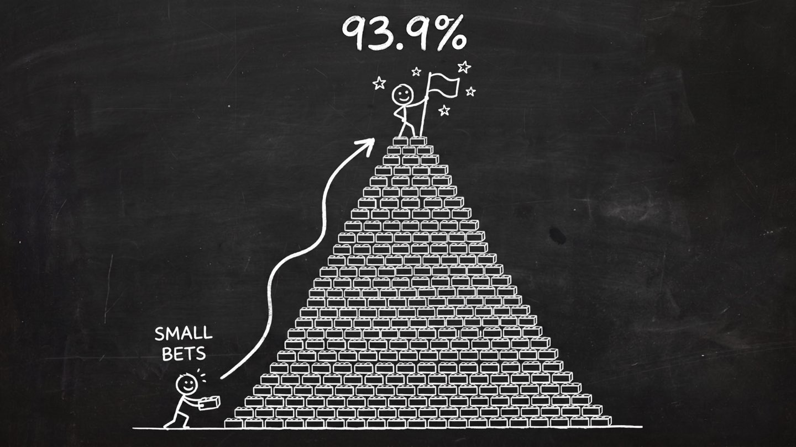

It is 12:20 on September 3rd, and I am on stage at DroidKaigi 2026, the largest Android conference in Japan. It is my time to talk. I have been preparing for this moment for the last six weeks. The timer starts, the first line comes out fine, and then... I forget the next one.

## How It All Began

It was May 2026, and I was preparing to present at **KotlinConf 2026**, the main conference that brings the Kotlin community together, organized by JetBrains. [My talk](https://www.youtube.com/watch?v=VVf6txPZk3Y) centered on how Sony adopted Kotlin Multiplatform (KMP) and Compose Multiplatform (CMP), working with hardware while these technologies were still in their unstable, early days. The main theme was our four-point framework for technology adoption: **use-case fit, ecosystem, tooling, and experimentation**.

The submission deadline for DroidKaigi 2026 was May 17. I *really* wanted to share our story and lessons with the Japanese community—which many of my friends belong to—and I wanted to do it in Japanese.

The KotlinConf talk was 45 minutes long, which wouldn't allow me to go too deep into any of the framework items. Therefore, I decided to submit a talk focusing on the "experimentation" item—one of my favorites, as I am also into Agile.

I asked my colleague Fujita, who has been with me since the beginning, if he was willing to be a co-speaker for our story. This would be my first time giving a talk with a co-speaker. Fujita and another colleague, Takuro, are my go-to friends for reviewing my presentation material for other conferences. In fact, I changed 30% of my initial KotlinConf talk thanks to their invaluable feedback.

He said yes.

The topic had been cleared by Sony's management, so on the last day to apply—May 17, a Sunday—I submitted the proposal.

## Preparation

The talk was accepted in June 2026. It was time to start preparations.

I plan to dive deeper into preparations for top conferences in another post, so for the sake of brevity, I will only scratch the surface here. The first thing was deciding the format. Key decisions we made:

* **The talk would be in Japanese.** I wanted to reach the Japanese community directly. For everyone else, the YouTube recording would be fine, and the English subtitles are usually quite good.
* **We would divide the talk**, and each member would deliver a part. No interaction between us. This would decrease the number of handovers and make things easier overall.
* **We would present in my usual style:** directly in front of the audience, without access to the slides. This would be the first time this was done at DroidKaigi, and it would be a challenge for Fujita since it was his first big conference. We didn't know if this would work. More on this later.

We started preparations in mid-July, 1.5 months before the conference:

* **Work on the story:** 3 weeks
* **Practice and adjust the story:** 1 week
* **Make the slides ➔ practice ➔ adjust loop:** 1.5 weeks

Unfortunately, due to work and other obligations, we were not able to fully use this time. We only had one week to practice, which made us quite nervous. Let me quickly break these down.

### The Story

This was divided into three parts.

#### 1. Message Map

I usually start with a Message Map inspired by Carmine Gallo's *Talk Like TED*. The objective is to have only **one** overarching message for the talk, and to deliver it through three key messages (you can think of these as sections). This is where I spend the most time for every talk.

We discussed, debated, and asked people about this. We knew what we wanted to talk about, but I am always looking for ways to package information so it is easy for the audience to understand. The final message map was the following:

```text
                    SMALL BETS. BIG MOVES.
                               │
┌──────────────────────────────┼──────────────────────────────┐
│                              │                              │
01 EXPERIMENT FIRST            02 BET ASYMMETRICALLY          03 BUILD A BOUNDARY
```

#### 2. Structure

How do we structure all the information we have so it is easy to understand? We had a head start here because of my KotlinConf 2026 talk. Therefore, we organized it like this:

```text
                    SMALL BETS. BIG MOVES.
                               │
┌──────────────────────────────┼──────────────────────────────┐
│                              │                              │
01 EXPERIMENT FIRST            02 BET ASYMMETRICALLY          03 BUILD A BOUNDARY
│                              │                              │
├─ Immovable factory date      ├─ First spike failed          ├─ Two teams, one product
├─ 2-week checkpoints          ├─ Standard as fallback        ├─ Three boundary rules
└─ Alpha; risk = 2–3 weeks     └─ Beta before the deadline    └─ 0.2%, no rewrite
```

#### 3. The Story Arc

I personally love having an arc to the talk, where we have a start, a middle, and an end. If the end closes the loop opened by the start of the talk—perfect. I usually spend a lot of time on this, simply because I *really* enjoy it. We let the title guide our decisions.

The title of the talk was: *Reaching 93% Kotlin: Replacing 4 Languages with Compose Multiplatform at Sony*.


So we started with Kotlin at 53%—that was literally the first slide. And we ended with Kotlin at 93.9%, completing the loop. 



### Practice and Adjustments

We decided that I would do the intro, key message 1, and the closing. Fujita would handle key messages 2 and 3 and deliver the lessons. So we needed only two handovers.

The next step was working on a script: a text file with each person's part. We worked on it, debated, changed things, and practiced individually. No slides yet.

### Slides

One and a half weeks before the conference, once we were happy with the story and our respective parts, it was time for the slides. We already had a head start here too because of the KotlinConf slides, as well as material from previous tech conferences where I had presented. Since all the material is made in my signature style—pitch-black background, with specific typography that works well with English and Japanese—we could reuse around 20% of it. The rest was newly created, but with the story and the script's main points already in place, that is really easy to do.

You can check the full deck on [Sony's SpeakerDeck](https://speakerdeck.com/sony/sony-droidkaigi2026):



### Rehearsal

We scheduled 3 dry runs where we would run the full presentation in an environment that resembled the real stage. There is a nice space on the 24th floor of the Sony building with a projector and a sound system, including wired and wireless mics and cameras.

We practiced the first time about a week and a half before the conference, on a Friday, with the new slides, and took a video. It was not that great, but that is expected. We provided feedback to each other, which was really nice. Japanese is not my native language, so Fujita gave me a lot of advice on which words to use and which *not* to use.

For example, for the introduction I wanted to say "this may seem irresponsible," which uses the word "無責任" (*musekinin*). He told me that it was not a good word to use, and instead we decided on "無謀" (*mubou*), which means "reckless." Things like that.

We decided to go back home, analyze the videos and feedback, practice some more, and 4 days later—on a Tuesday—run another dry run.

The next dry run was OK. My family was coming to Japan, so I took some days off, and we set the last rehearsal session for Monday of the next week. The conference would start on Tuesday of that week, so we would not have any more time to practice.

The last practice was good. We were ready for the talk. Or so we thought.

## A New Talk Style

I really like to connect with the audience, and I have some strong opinions about this. At DroidKaigi, like at many other conferences, the speaker stays behind the lectern and presents looking at the computer. I don't like lecterns—I don't like to have *anything* between me and the audience—as I believe that the best way to transmit information is to have a conversation.

As far as I know from the videos of previous DroidKaigis and from talking with staff and participants, having the lectern behind you has never been done. So this was the first challenge: to request something that unusual, never done at DroidKaigi. I was kind of expecting that the request would be refused.

The second challenge was that Fujita might feel uncomfortable with this style. You see, with this style you don't have access to speaker notes, and you cannot see which slide is next. The computer is behind you, you only have a clicker, and you are on your own. You have to know your talk by heart. That doesn't mean you have to memorize it, but you need to know what slide comes after which slide, which makes the talk smoother. If you miss one slide, it may mess things up (actually, I *did* miss one slide). There is a confidence screen—the screen in front of you on the floor—but it just shows you which slide is active, as it mirrors what the audience is seeing, so it is kind of useless for anything else.

And there is the fact that being right in front of the audience, with nothing between you and them, makes you feel vulnerable. This is uncomfortable, and it is not for everyone. I have done this many times, but I still can't help feeling uncomfortable at the start of my talks. And this was the first time for Fujita being in a big room with dozens or hundreds of people, so I was not sure he would be fine.

Eventually, that was the style we went with.

I was fortunate that the DroidKaigi staff accepted my request to push the lectern back and allow me to present directly in front of the audience. Also, my demo required some walking on the stage, which created some new challenges for the AV staff. I know this created hurdles—like having to adjust the lighting and having someone operate the camera to follow me walking on the stage—and I am really grateful for it. I truly believe it contributed to transmitting the message to the audience.

Fujita told me afterwards that he almost gave up on this style, but we are all glad we did it. For the first time at DroidKaigi, we presented directly to the audience, without looking at the computer or leaning on the lectern, and we had a blast.

## The Talk

For every talk, I try to memorize the first sentences and the last ones.

It is my experience that when the talk starts, no matter how much you have prepared, you always get nervous. And that is fine. The adrenaline rushes, the heart pumps faster, you get tunnel vision, and sometimes you even draw blanks.

I hadn't slept much, since I was volunteering for the conference as well as working at Sony's booth, and the last few weeks had been tough at work. I was exhausted. But I had practiced the introduction many times, and I was pretty confident. When the talk began, it started OK, but then I forgot the second sentence. I was puzzled. I didn't panic; actually, I found the whole situation quite funny because it was so unexpected. Eventually, I improvised, and it was all OK. Something else I found funny is that after watching the video recording, it looks smooth, but while on stage it felt like the time I was trying to recover was much, much longer. Talk about time dilation and perception! 😅

After this first hiccup, the rest of the talk went fine. There was one part at the end where I missed a slide that I had just added the night before. And this is when you see that the audience is rooting for you, when they clap as if saying, "It is OK."

All in all, I wouldn't change a thing. I love these war stories, and I knew the risks of my style of presentation—not being able to see the computer and going through 100 slides. But the connection I felt with the audience, the feedback we got, and the influence it had on the future actions of some people in the audience were totally worth the risk. I loved every moment of the talk.

## The Demo

We had two demos. I have always liked Steve Jobs's 2007 iPhone reveal talk, where his demos were smooth. My goal had always been to achieve that level of smoothness—to avoid changing applications during the presentation. I was able to achieve this at KotlinConf 2026, and many people asked me how I did it. I will make another post explaining this in detail, but this time I wanted to go further than at KotlinConf. It would be the same demo, but now capturing sound—not from the device, but from the Bluetooth headset, streaming it directly to my presentation with no change of screens.

I was extremely happy when I was able to pull it off.

The demo consisted of me walking: the headphones would recognize I was walking (thanks to their sensors), update the UI, and trigger a song on Spotify. When doing public talks, one needs to be careful about copyrighted content, so just playing any song would be risky. Fortunately, my father is an artist and has albums on Spotify, so I played one of his songs.

You can check the demo in the [YouTube recording, starting at 22:14](https://youtu.be/UWalcwoLeSM?t=1334).

## The Results

We got a lot of positive feedback, both soon after the talk and from people coming to the Sony booth to talk about the presentation and the topic. Also, it gave us an opportunity to interact with the community, get to know a lot of interesting people, and hear about stories and similar challenges in areas different from ours.

At the time of this writing (September 11), our talk's YouTube recording is among the top 5 most viewed and liked videos of DroidKaigi 2026. Here it is in full:



## Lessons Learned

I am still reflecting on the whole episode, but the main lessons I took are:

* **Japan tech conferences are amazing.** The mood at DroidKaigi is more like a festival (祭り, *matsuri*). If you have the opportunity, apply for it; it is one of the best conferences around.
* **It pays off to put in all the work necessary for a memorable talk.** It is hard work, but the results are incredibly gratifying.
* **Step out of your comfort zone.** You only step up when you push yourself. The challenge this time was to have a co-speaker and to do such a high-profile talk in Japanese, when it would have been so much easier to do in English.
* **It is OK to make mistakes.** Everyone does it. It doesn't matter how prepared you are; unexpected things will always happen.
* **The final and most important lesson.** I already knew this, but it was nice to be reminded of it: **the audience is rooting for you**. As long as you are enthusiastic about your message and you put in the work, it doesn't matter what happens—you will be fine.
